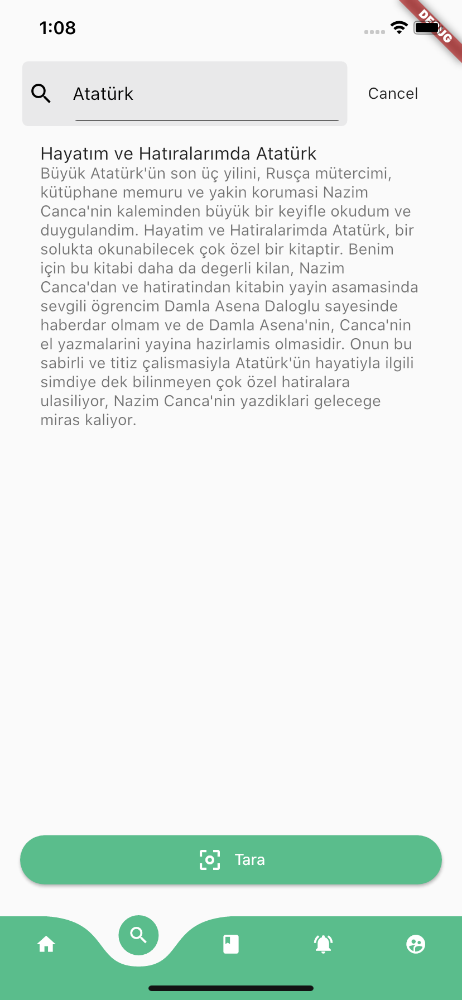
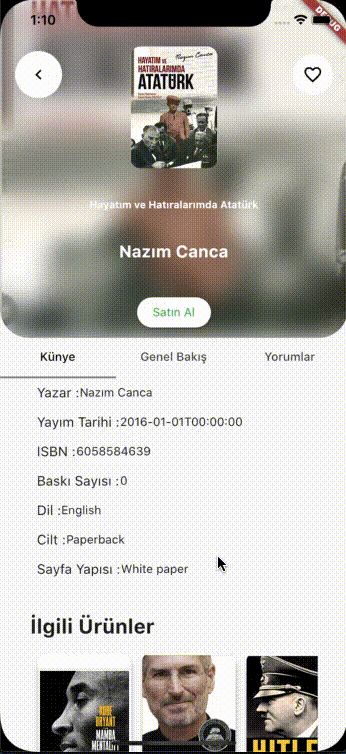

# KitApp
Emek kokan mobil uygulama

     

KitApp, kitapseverlerin çok işine yarayacağı, özgün tasarımıyla severek kullanacağı bir uygulamadır.

  - Kütüphaneniz kitapla doldu, Akmar'da gereğinden ucuza satmak istemiyorsanız
  - Kitap almak istiyorsunuz ama fiyat araştırması yapmak için üşengeçseniz
  - İkinci el kitap almak için Akmar'da saatlerce dolaşmak istemiyorsanız
  - Aradığınız kitapları sadece barkod numarası ile bulmak istiyorsanız
  - Satmak istediğiniz kitabı barkod numarası ile kolayca satmak istiyorsanız
  - Doğru yerdesiniz...

---

## Özellikler

  - Kategorilere göre favori kitaplarını listeleme
  - Sana yakın lokasyonda bulunan satıcılarla iletişime geçebilme
  - Kitaplarının barkodlarını taratarak hızlıca satışa çıkarabilme
  - Aradığın kitabın barkodunu taratarak hızlıca kitap bilgilerine erişebilme
  - Karanlık / Açık tema özelliği
  - Çoklu dil seçeneği

## Linkler
  - <a href="https://hasansahin.net/index.html" >**Swagger**</a>
  - <a href="https://trello.com/b/j8ZvZ3C9/sprint-1" >**Trello Board**</a>
  - <a href="https://www.canva.com/design/DAEIDvCZH1Y/bxlVV-2sQi2LT-Lc_7aHZw/edit" >**Sunum**</a>

## Screenshots

Anasayfa Açık Tema                  |   Anasayfa Karanlık Tema
:------------------------------:|:------------------------------:
|  

Kitap Arama                  |  Kitap Detay
:---------------------------:|:---------------------------:
|  

---

## Takımımız

| <a href="https://github.com/hasansahinnn" target="_blank">**Hasan Şahin**</a> | <a href="https://github.com/edaersu" target="_blank">**Eda Ersu**</a> | <a href="https://github.com/fatihemree" target="_blank">**Fatih Emre Kalem**</a> | <a href="https://github.com/beyzabakici" target="_blank">**Melike Beyza Bakıcı**</a> | <a href="https://github.com/alperenkbd" target="_blank">**Alperen Kabadayı**</a> | <a href="https://github.com/Turgutalp" target="_blank">**Turgutalp Tug**</a> | <a href="https://github.com/chillxcode" target="_blank">**Emre Çelik**</a> |
| :---: |:---:| :---:| :---:| :---:| :---:| :---:|
|  |   |  |  |  |  |  |

---

## License

- **[MIT license](http://opensource.org/licenses/mit-license.php)**
- Copyright 2020 © <a href="https://www.vbt.com.tr" target="_blank">VBT Bilgi Teknolojileri</a>.